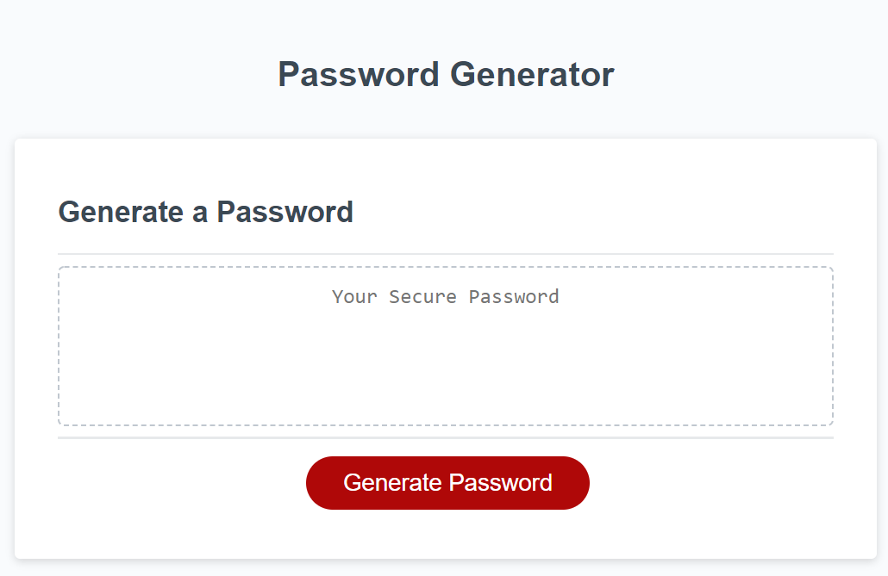
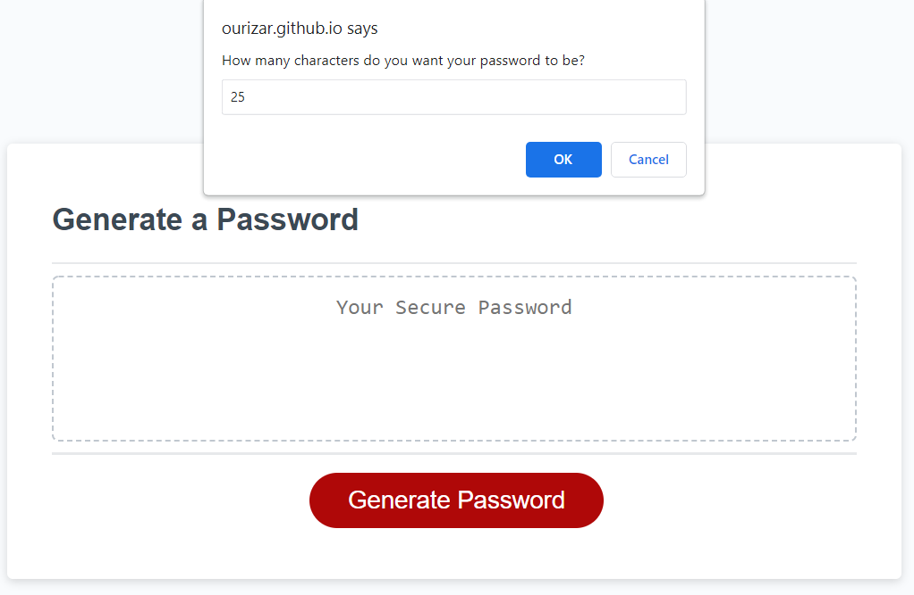
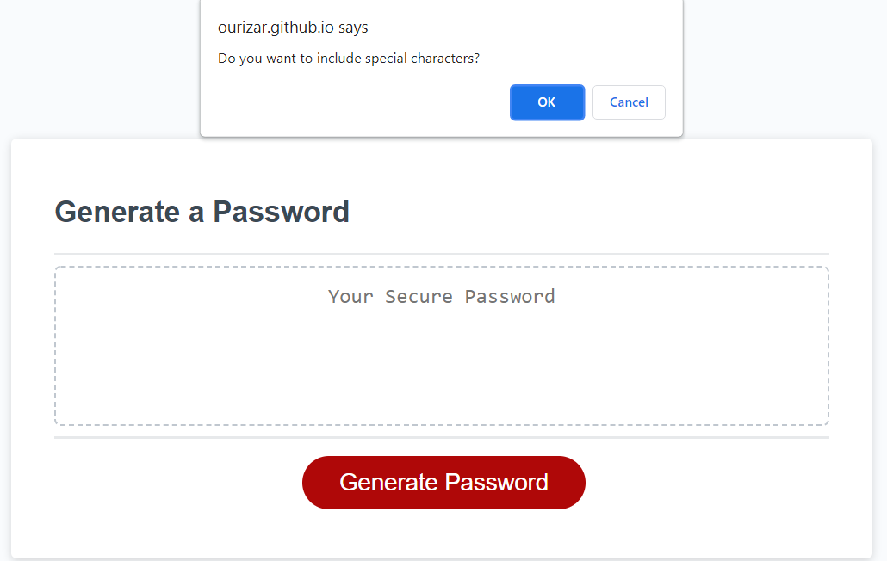
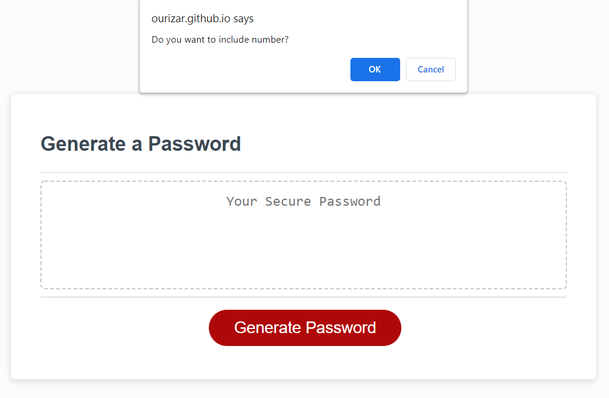
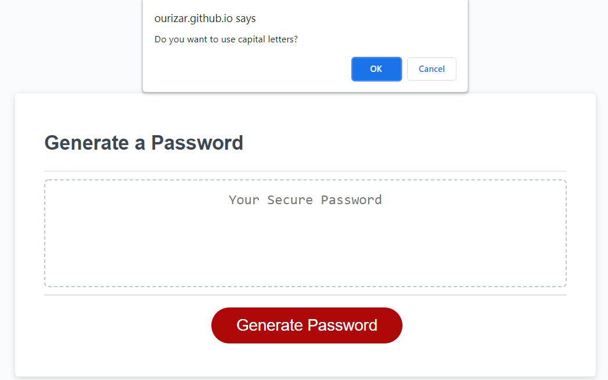
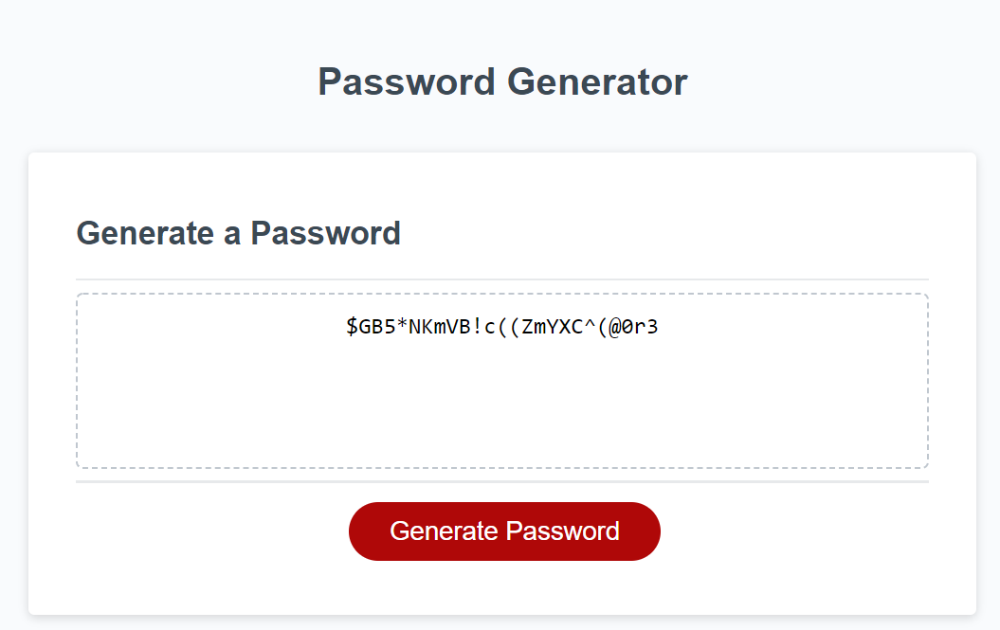

# Random-Password-Generator
This application is designed to generate a strong password. An employee of a company can come to this web app and create a unique password to help keep their data secure. Upon accessing this web app a user will come across a red button to Generate a password.
Once the Generate Password button is clicked the user will be prompted with several windows.
The windows will ask the user 4 questions and based upon the answers they input the web app will generate a randomized password based on the user's input.
The criteria for this password is as follows:
    a. How long should the password be?
    b. Do you want to use special characters?
    c. Do you want to use numbers?
    d. Do you want to use Uppercase letters?

Please visit the website at:
https://ourizar.github.io/Random-Password-Generator/

Screenshots Below:

  
  
  
  
  
  

